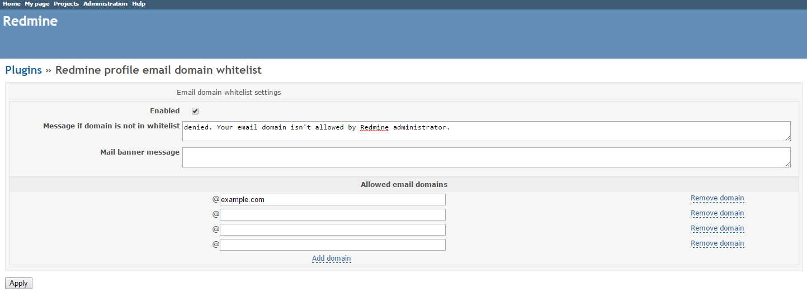

# Redmine Profile Email Domain Whitelist Plugin

This plugin enables you to configure a list of email domains that can be specified in Redmine user profiles.

The initial author is [Vladimir Kiselev](https://github.com/nettsundere/redmine_profile_email_domain_whitelist).

## Installation

*These installation instructions are based on Redmine 2.6.0. For instructions for previous versions, see [Redmine wiki](http://www.redmine.org/projects/redmine/wiki/Plugins).*

1. To install the plugin
    * Download the .ZIP archive, extract files and copy the plugin directory into *#{REDMINE_ROOT}/plugins*.
    
    Or

    * Change you current directory to your Redmine root directory:  

            cd {REDMINE_ROOT}
 
      Copy the plugin from GitHub using the following command:

            git clone https://github.com/Undev/redmine_profile_email_domain_whitelist.git plugins/redmine_profile_email_domain_whitelist

2. Install the required gems:  

         bundle install

3. Restart Redmine.

Now you should be able to see the plugin in **Administration > Plugins**.

## Usage

The plugin enables you to specify the list of email domains allowed in Redmine. To do this, go to **Administration > Plugins** and click **Configure**.  

Note that the configured settings will be applied only if you select the **Enabled** check box.

To add a domain to Redmine whitelist, click **Add domain** and type the domain in the corresponding field. You can add as many domains as you need. To remove a domain from the list, click **Remove domain**.

In the **Message if domain is not in whitelist** field, you can specify a custom text to be displayed if a user tries to create a new account and enters an email that is not allowed.

In the **Mail banner message** field, you can add a text prompt that will be displayed below the **Email** field on the **New user** page.

## Maintainers

Danil Tashkinov, [github.com/nodecarter](https://github.com/nodecarter)

## License

Copyright (c) 2015 Undev

Licensed under the Apache License, Version 2.0 (the "License");
you may not use this file except in compliance with the License.
You may obtain a copy of the License at

http://www.apache.org/licenses/LICENSE-2.0

Unless required by applicable law or agreed to in writing, software
distributed under the License is distributed on an "AS IS" BASIS,
WITHOUT WARRANTIES OR CONDITIONS OF ANY KIND, either express or implied.
See the License for the specific language governing permissions and
limitations under the License.
